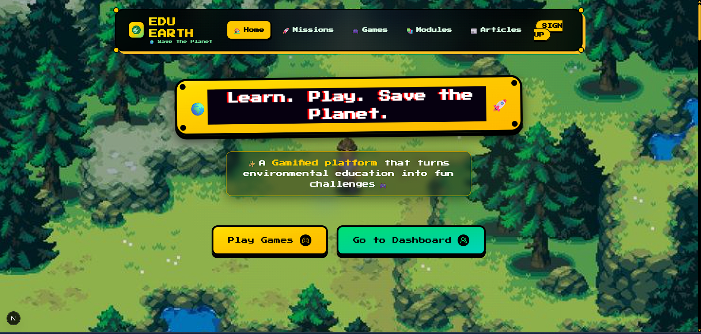
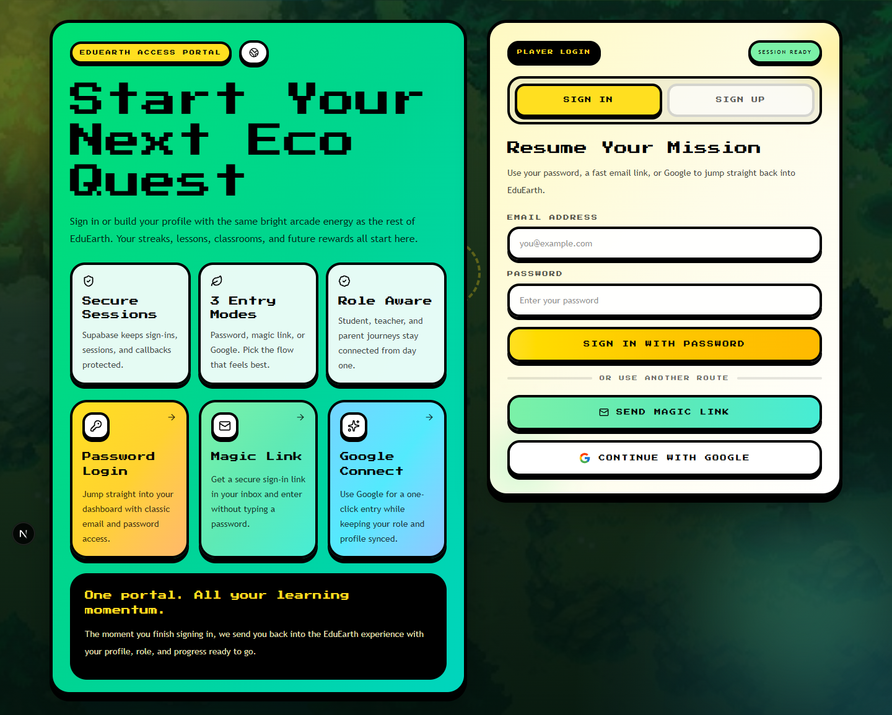
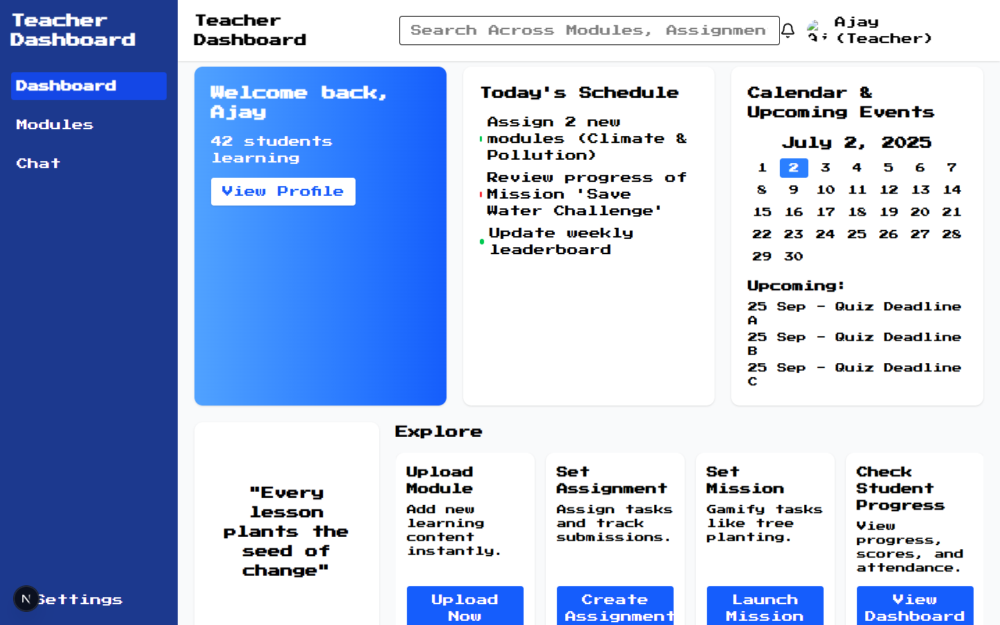
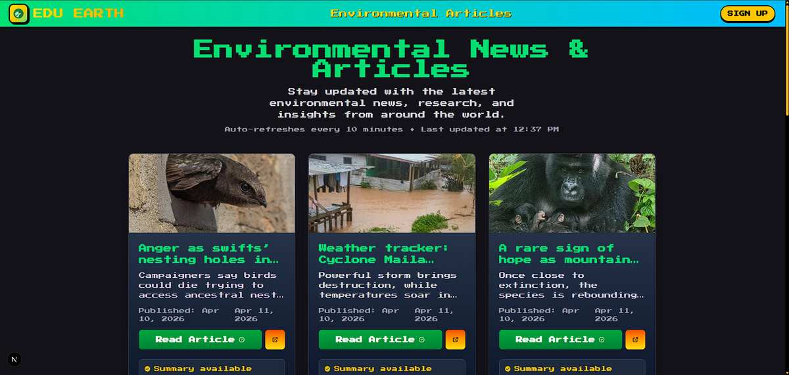
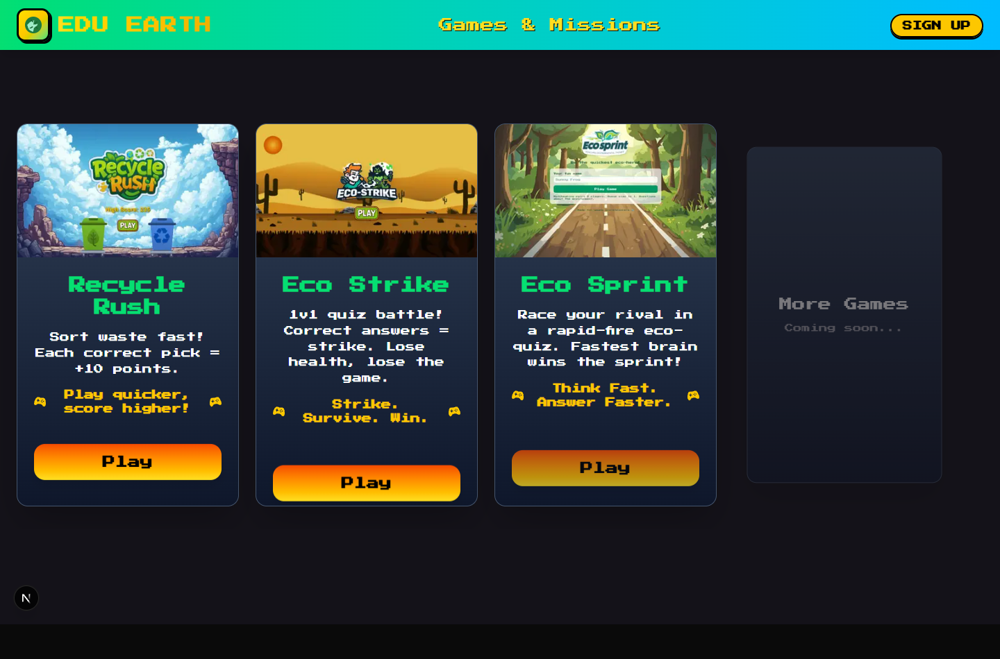
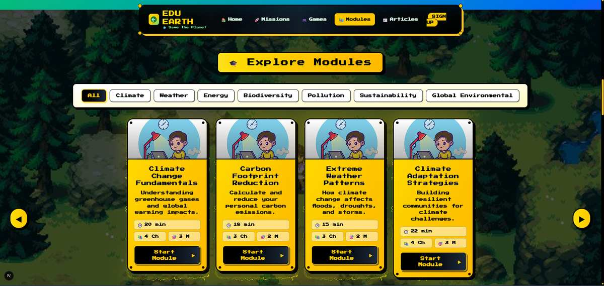

# EduEarth

EduEarth is a gamified environmental education platform for students, teachers, and institutions. The project combines a Next.js learning experience, an Express/Prisma API, real-time Socket.io game services, Supabase authentication, and a Python/Airflow workspace for environmental article/data workflows.



## Current Highlights

- Student and teacher dashboards with role-aware routing.
- Supabase-backed authentication and profile sync through the server API.
- Environmental articles page with auto-refresh, image support, and optional AI summaries.
- Interactive game hub with Recycle Rush, Eco Strike, and Eco Sprint.
- Learning modules, course detail pages, assignments, missions, leaderboards, and certificates UI.
- REST APIs for users, institutions, classes, lessons, quizzes, articles, and game health/stats.
- Prisma schema for users, institutions, classes, lessons, quizzes, challenges, badges, achievements, leaderboards, notifications, and articles.
- Server Docker and production Docker Compose files.
- Python/Airflow project scaffold for ETL workflows.

## Tech Stack

| Area | Tools |
| --- | --- |
| Client | Next.js 15, React 19, TypeScript, Tailwind CSS 4, Framer Motion |
| Server | Node.js, Express 5, TypeScript, Socket.io |
| Data | PostgreSQL, Prisma, Supabase |
| Auth | Supabase Auth with server-side token validation |
| ETL | Python, Apache Airflow/Astronomer scaffold |
| Deployment | Docker, Docker Compose, Vercel-compatible client |

## Repository Structure

```text
EduEarth/
  client/                 Next.js application
    app/                  App Router pages
    components/           Shared UI and game components
    lib/                  API, auth, module, and type helpers
    public/               Images and game assets
  server/                 Express API and Socket.io server
    src/controllers/      Route handlers
    src/routes/           API route definitions
    src/game/             Real-time game server
    src/prisma/           Prisma schema and migrations
    src/utils/            Supabase, mail, env, and response helpers
  python/                 Airflow/Astronomer project scaffold
  project_screenshots/    Product screenshots, diagrams, and demo video
```

## Screenshots

| Home | Student Dashboard |
| --- | --- |
|  |  |

| Teacher Dashboard | Articles |
| --- | --- |
|  |  |

| Games | Modules |
| --- | --- |
|  |  |

## Prerequisites

- Node.js 18 or newer
- npm or Bun
- PostgreSQL database, usually Supabase Postgres
- Supabase project with public URL and publishable key
- Docker, optional for server deployment
- Astronomer CLI, optional for the Python/Airflow workspace

## Environment Variables

Create `server/.env` from `server/.env.example`:

```env
PORT="6969"
SERVER_BASE_URL="http://localhost:6969"
CLIENT_BASE_URL="http://localhost:3000"
NODE_ENV="development"

DATABASE_URL="postgresql://postgres.<project-ref>:[YOUR-PASSWORD]@aws-<region>.pooler.supabase.com:5432/postgres?sslmode=require"
SUPABASE_URL="https://<project-ref>.supabase.co"
SUPABASE_PUBLISHABLE_KEY=""
```

Create `client/.env.local` from `client/.env.example`:

```env
NEXT_PUBLIC_SERVER_URL=http://localhost:6969
NEXT_PUBLIC_SUPABASE_URL=https://<project-ref>.supabase.co
NEXT_PUBLIC_SUPABASE_PUBLISHABLE_KEY=
```

Optional server integrations currently referenced in the codebase include `GUARDIAN_API_KEY`, `GMAIL_USER`, and `GMAIL_PASS`.

## Local Development

Install dependencies:

```bash
cd client
npm install

cd ../server
npm install
```

Prepare Prisma:

```bash
cd server
npx prisma generate
npx prisma migrate dev
```

Run the backend:

```bash
cd server
npm run dev
```

Run the frontend in another terminal:

```bash
cd client
npm run dev
```

Open:

- Client: http://localhost:3000
- API: http://localhost:6969
- API health: http://localhost:6969/health
- Game health: http://localhost:6969/game/health
- Flow view: http://localhost:6969/flow

## Available Scripts

Client:

```bash
npm run dev      # Start Next.js development server
npm run build    # Build production client
npm run start    # Serve production build
npm run lint     # Run ESLint
```

Server:

```bash
npm run dev      # Start Express server with tsx watch
npm run build    # Generate Prisma client and compile TypeScript
npm run start    # Run compiled server
npm run lint     # Type-check without emitting files
npm run clean    # Remove build output
```

## API Overview

Base URL: `http://localhost:6969`

| Resource | Endpoints |
| --- | --- |
| Health | `GET /health` |
| Flow | `GET /flow`, `GET /flow/data` |
| Auth | `GET /auth/user`, `POST /auth/user`, `PATCH /auth/user` |
| Institutions | `GET/POST /institutions`, `GET/PUT/DELETE /institutions/:id`, statistics, students, teachers, classes |
| Classes | `GET/POST /classes`, `GET/PUT/DELETE /classes/:id`, student and teacher enrollment, statistics |
| Lessons | `GET/POST /lessons`, `GET/PUT/DELETE /lessons/:id`, completions, lesson modules |
| Quizzes | `GET/POST /quizzes`, `GET/PUT/DELETE /quizzes/:id`, questions, attempts |
| Articles | `GET/POST /articles`, `GET/PUT/DELETE /articles/:id`, source, section, statistics |
| Games | `GET /game/health`, `GET /game/stats`, Socket.io game events |

Protected routes expect a Supabase bearer token:

```http
Authorization: Bearer <supabase-access-token>
```

## Games

- `Recycle Rush`: waste sorting game with custom image assets.
- `Eco Strike`: 1v1 quiz battle where correct answers trigger attacks.
- `Eco Sprint`: real-time eco quiz race powered by Socket.io.

Game pages live under `client/app/games`, with reusable components in `client/components/games`.

## Articles And ETL

The article UI reads from the server `/articles` API and displays environmental stories from the database. Article records support:

- headline, body, source, section, URL
- publish and extracted dates
- image URL
- optional AI summary

The `python/` folder contains an Airflow/Astronomer scaffold that can be used for ingestion and ETL workflows.

## Docker

From `server/`, run the development compose file:

```bash
docker compose up --build
```

For production server deployment:

```bash
docker compose -f docker-compose.prod.yml up -d --build
```

Set production secrets in `server/.env.production` before using the production compose file.

## Python/Airflow Workspace

The `python/` folder is an Astronomer project. To start Airflow locally:

```bash
cd python
astro dev start
```

Airflow UI defaults to http://localhost:8080.

## Project Assets

Useful visual references are stored in `project_screenshots/`, including:

- architecture diagram: `arch.png`
- database diagram: `database.png`
- data-flow diagrams
- authentication, Eco Sprint, and Airflow flow diagrams
- demo video: `EduEarth.mp4`

## Notes For Contributors

- Keep client code in TypeScript and follow the existing App Router structure.
- Keep server changes scoped by route/controller pairs.
- Run `npm run lint` in `server` before changing API contracts.
- Run `npm run lint` and `npm run build` in `client` before UI releases.
- Update this README when routes, setup steps, environment variables, or major user-facing features change.
