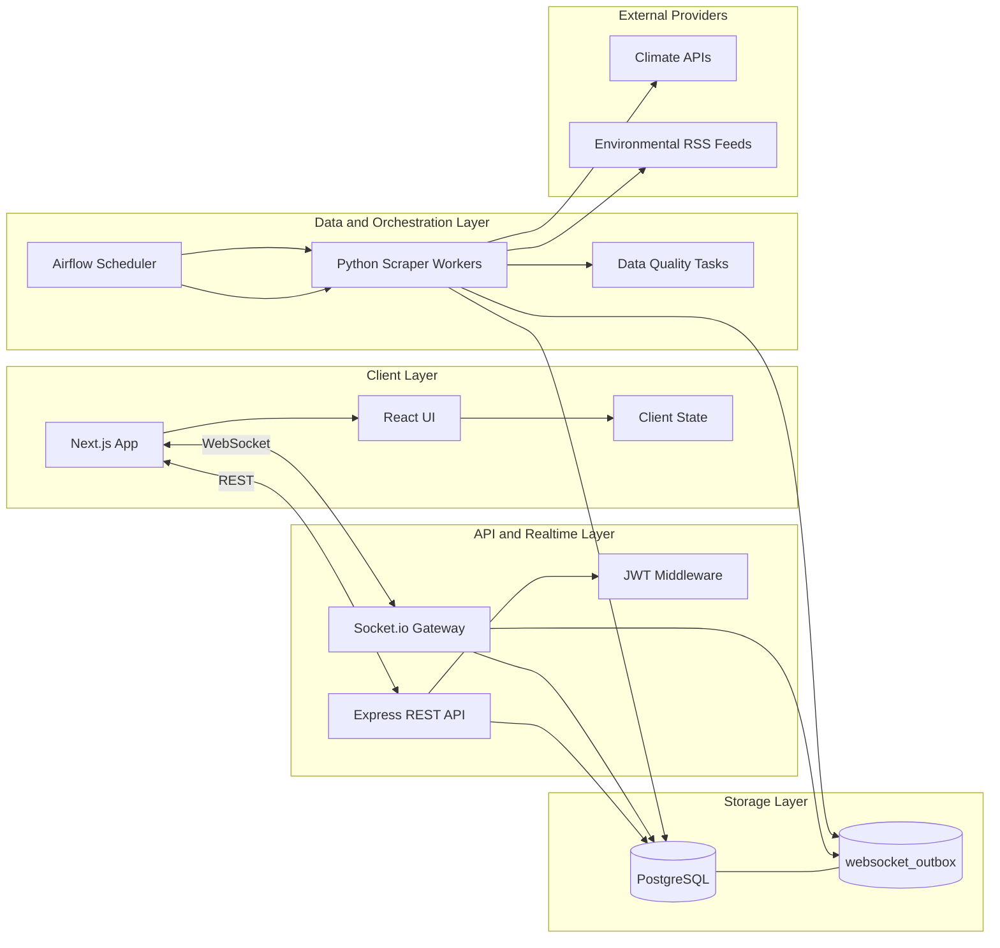

# Environmental Data Platform Architecture V2

## Objective

This architecture decouples provider ingestion from the API server by moving all external data fetching to Python scraper jobs orchestrated by Apache Airflow.

## What Changes

- External provider calls move out of the Express server.
- Apache Airflow schedules and retries scraper runs.
- Python scraper workers become the only components that call Climate APIs and RSS feeds.
- Express serves historical data from PostgreSQL and broadcasts realtime deltas over WebSockets.

## Layered Architecture

1. Client Layer

- Next.js application
- REST calls for historical queries
- WebSocket subscriptions for realtime updates

2. API and Realtime Layer

- Express REST API for auth, filtering, pagination, and domain logic
- Socket.io gateway for realtime events
- Reads from PostgreSQL and optional Redis cache
- Does not fetch from external providers

3. Data Orchestration and Ingestion Layer

- Airflow Scheduler and DAGs
- Python scraper jobs with source-specific adapters
- Retry and backoff policy for provider errors
- Data quality and freshness checks

4. Data Layer

- PostgreSQL via Prisma for API reads
- Ingestion tables for raw and curated records
- Outbox table for reliable websocket event fan-out

## Component Relationship Diagram

## Interaction Breakdown

### 1. Scheduled historical ingestion

1. Airflow starts a DAG run on schedule.
2. Airflow passes runtime parameters to scraper tasks:
   - provider
   - since cursor
   - region set
   - throttle profile
3. Scraper calls external providers and normalizes payloads.
4. Scraper upserts historical records in PostgreSQL.
5. Scraper records metrics and status in ingestion_runs.
6. Airflow completes run and raises alerts on SLA violations.

### 2. Realtime data propagation to clients

1. Scraper writes newly ingested records.
2. Scraper inserts lightweight events into websocket_outbox.
3. Express websocket publisher reads unsent outbox events.
4. Express emits domain events through Socket.io rooms.
5. Express marks outbox events as sent.

This keeps realtime delivery in the server while ingestion remains fully decoupled.

### 3. Failure and retry behavior

- Provider timeout: task retries with exponential backoff.
- Provider rate limit: task pauses or retries according to source profile.
- Partial batch failure: only failed tasks retry; successful source tasks remain committed.
- Publisher failure: websocket_outbox supports delayed re-delivery without re-scraping.

## Responsibilities by Component

### Airflow Scheduler

- Owns orchestration, schedules, retries, alerting, and dependency graph.
- Does not parse provider payloads or serve API traffic.

### Python Scraper

- Owns provider integration and schema normalization.
- Performs idempotent upserts and data quality checks.
- Publishes outbox events for realtime fan-out.

### External Providers

- Source-of-truth for inbound climate and news content.
- Accessed only by scraper workers.

### Express API and WebSocket Layer

- Serves read APIs from PostgreSQL.
- Emits websocket updates from outbox and or DB notifications.
- No direct external fetch path.

## Suggested DAG Topology

- env_climate_fast_refresh: every 5 minutes
- env_news_rss_refresh: every 10 minutes
- env_historical_backfill: daily
- env_quality_checks: hourly

## Data Contract (high level)

- climate_observations: time-series climate records
- news_articles_ingested: normalized RSS article records enriched with curriculum_topic, grade_band, difficulty_level, learning_objective, curriculum_tags, and relevance_score
- ingestion_runs: run metadata and counters
- websocket_outbox: transient event queue for websocket fan-out

## Curriculum Enrichment Transform

The Python DAG performs curriculum enrichment before persistence by deriving:

- curriculum_topic from environmental keyword taxonomy
- grade_band using content-length complexity heuristics
- difficulty_level mapped from grade band
- learning_objective generated from topic and level
- curriculum_tags and relevance_score for filtering and recommendations

This transform turns external raw feeds into classroom-ready content while keeping the API layer read-only.

## Reliable Outbox Publishing

The Express layer runs an outbox publisher worker that:

1. Polls unsent rows from websocket_outbox
2. Uses row locking (FOR UPDATE SKIP LOCKED) inside a transaction
3. Emits Socket.io events by channel and event name
4. Sets sent_at only for successfully emitted rows

If emit fails, rows remain unsent and are retried on later cycles.

## Migration Notes for Current Codebase

Server-side external fetch logic currently exists in the article controller and should be moved into scraper adapters.

Target migration pattern:

- Keep article query endpoints.
- Remove or deprecate direct provider fetch in API request path.
- Trigger ingestion only through Airflow schedules or explicit internal re-sync endpoints that enqueue jobs.

## Rollout Plan

1. Introduce new ingestion tables and DAGs.
2. Run DAGs in shadow mode while keeping existing API behavior.
3. Validate parity between old and new article/climate records.
4. Switch API reads to ingestion tables as system-of-record.
5. Disable direct provider fetch code in the server.
6. Enable websocket outbox publisher in server runtime.

## Non-Functional Requirements

- Idempotency keys for all ingested records.
- Source-level watermarks to avoid duplicates and gaps.
- Freshness SLA tracking per source.
- End-to-end observability for ingestion lag and websocket fan-out latency.
